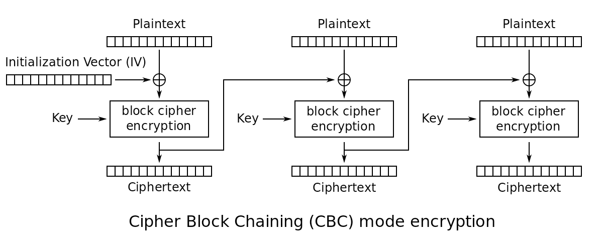

# Raydreams.Encryption

## Description

This is a simple command line example on how to Symmetrically encrypt files using AES with a 256 bit key. Remember, Symmetric is stronger and harder to crack even with a shorter key. It's downside is you can't share the key with anyone you don't want to be able to open your files. Every computer in the world working together to brute force an AES 256 key would not find the solution before you died.



**However**

In this example the key is generated from a text password, though of course you can use a byte key. Using a text password just makes it easier to remember the key but probably less secure. A truely random 32 byte key is best. Keep in mind that the password is independent of the key. The password is just used to create a key.

A key maker has to be salted. Use any salt you like. However, you have to use the same salt if you are using a plain text key.

So, while a random 32 bit key would be impossible to guess, if you generate your key from a simple password (and an attacker knows that), finding the pass phrase that **created** your key would be much easier.

## Execution

The included command line Program is just to demonstrate how to use the included classes. Modify the path to the file you wish to encrypt and set a password. You can also modify the salt to whatever you want.

```
class Program
{
    /// <summary>Salt to use on the Key Maker. At least 8 bytes. Should remain the same.</summary>
    private static readonly byte[] salt = new byte[] { 0x21, 0xba, 0xdf, 0xd0, 0x8c, 0x89, 0x97, 0x0c, 0x2b, 0xd0, 0x71, 0x86, 0x4e, 0x32, 0x2e, 0x52 };

    static void Main( string[] args )
    {
        // use a string based Password to generate the actual key
        byte[] key = KeyMaker.MakeKey( "Password1", salt );

        // path to the test file
        string path = $"{RayXFile.DesktopPath}/PROS.jpeg";

        // encrypt file handler
        RayXFile fe = new RayXFile(key);

        // encrypt the file
        FileInfo ecPath = fe.EncryptFile( path );
        Console.WriteLine( $"File Encrypted to {ecPath}" );

        // decrypt the file
        FileInfo dePath = fe.DecryptFile( ecPath.FullName );
        Console.WriteLine( $"File Decrypted to {dePath}" );
    }
}

```

## File Format

The file format created here is called **rayx** which is cutom. It is easy to change. It's just a spec I made up. I'm totally open to changing it. The 256 byte metadata area is not yet in use.

The byte layout is:

| Bytes | Byte Size | Description |
|-------|-----------|-------------|
| 1-4 | 4 | Magic Number of header bytes which is always ray\0 |
| 5-6 | 2 | File Format version number which for now is always 10 |
| 7-22 | 16 | The initialization vetor used in the AES encryption to encrypt the file |
| 23-24 | 2 | Data Delimiter which is always 01 |
| 25 | 1 | The length of the string of the original file extension e.g. jpeg = 4 |
| 26-(N-1) | N |The original extension string
| (26+N)-(26+N+2) | 2 | Data Delimiter again |
| (26+N+3) | 1 | Length of metadta which for now is unused and thus 0
| (26+N+4) | M | the actual encrypted data |

### Initialization Vector (IV)
The IV seeds the algorithm (the starting point) and required for decryption. However, knowing it will not help in cracking. AES 256 uses a 4x4 block vector and the 16 IV bytes are used to initialize that vector instead of setting them all to 0.

## Future Enhancements

I plan to create a drag and drop desktop utility that will perform the encyption and decryption. A public open source repo ensures no funny business is going on unlike some app you might download from the app store written by a guy in his basement.

## What's It For

Encrypt your own sensitive files to store in a cloud drive. Seriously, do you trust Apple, Amazon, DropBox, Microsoft, ...?